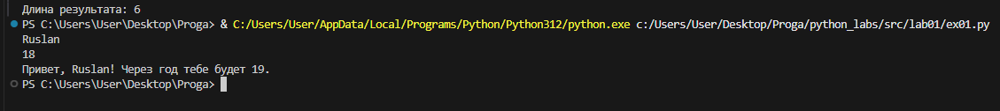
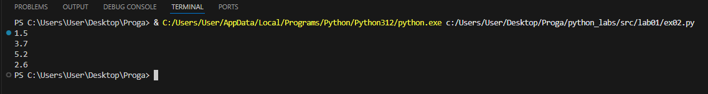
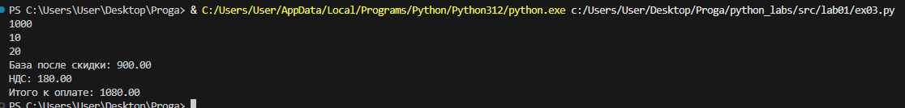
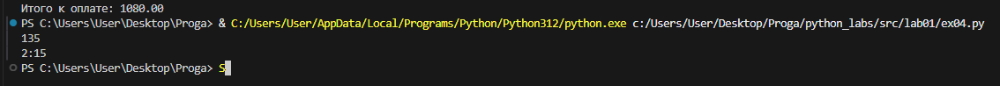
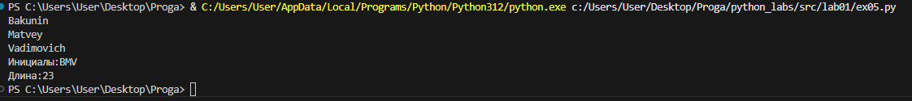
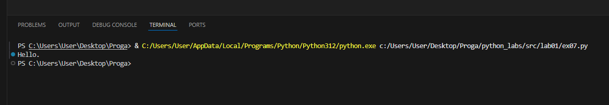

# python_labs
# Лабораторная работа №1 
# Задание №1
```python
Name = input()
Age = int(input())
print("Привет,", Name + "!" ,"Через год тебе будет", Age + 1, end = ".")
```


# Задание №2
```python
a = float(input())
b = float(input())
sum = a + b
avg = (a + b) / 2
print(sum)
print(avg)
```

# Задание №3
```python
price = int(input())
discount = int(input())
vat = int(input())
base = price * (1 - discount / 100)
vat_amount = base * (vat/100)
total = base + vat_amount
print("База после скидки:", f"{base:.2f}")
print("НДС:", f"{vat_amount:.2f}")
print("Итого к оплате:", f"{total:.2f}")
```

# Задание №4
```python
minutes = int(input())
print(minutes // 60, ":",minutes % 60, sep = "")
```

# Задание №5
```python
a, b, c = input(), input(), input()
print("Инициалы:", a[0], b[0],c[0],sep = "")
print("Длина:", len(a + b + c), sep = "")
```


# Задание №7 
```python
a = "thisisabracadabraHt1eadljjl12ojh."
index1 = 0
for j in range(0, len(a)):
    for i in "QWERTYUIOPASDFGHJKLZXCVBNM":
        if a[j] == i:
            index1 = j
            break

index2 = 0
for c in range(0, len(a) - 1):
    if (a[c] in "0123456789") and ((a[c + 1] in "qwertyuiopasdfghjklzxcvbnm") or (a[c + 1] in "QWERTYUIOPASDFGHJKLZXCVBNM")):
        index2 = c
        break

razn = abs(index1 - index2) + 1
g = a[index1::]
m= ""
for k in range(0, len(g), razn):
    m += g[k]
print(m)
```
