<<<<<<< HEAD
# python_labs
# Лабораторная работа №1 
 Задание №1
```python
Name = input()
Age = int(input())
print("Привет,", Name + "!" ,"Через год тебе будет", Age + 1, end = ".")
```


 Задание №2
```python
a = input()
b = input()
a = a.replace(",",".",1)
b = b.replace(",",".",1)
a = float(a)
b = float(b)
sum = a + b
avg = (a + b)/2
print(f"{sum:.2f}")
print(f"{avg:.2f}")
```
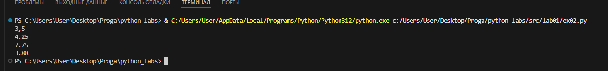
 Задание №3
```python
price = float(input())
discount = float(input())
vat = float(input())
base = price * (1 - discount/100)
vat_amount = base * (vat/100)
total = base + vat_amount
print("База после скидки:",f"{base:.2f} ₽")
print("НДС:",f"{vat_amount:.2f} ₽")
print("Итого к оплате:",f"{total:.2f} ₽")
```
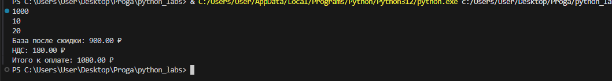
 Задание №4
```python
minutes = int(input())
print(minutes // 60, ":",minutes % 60, sep = "")
```

 Задание №5
```python
FIO = input()
k = 0
b = []
c = []
x = []
t = len(FIO)
for i in FIO:
    if i == " ":
        k = k + 1

if k != 2:
    t = t - k + 2

a = FIO.split()

b.append(a[0])
c.append(a[1])
x.append(a[2])

q = b[0]
w = c[0]
e = x[0]
print("Инициалы:", q[0], w[0], e[0],sep="")
print("Длина символов:", t)
```
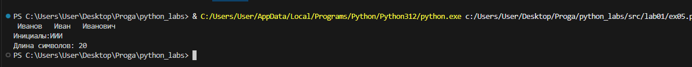

 Задание №7 
```python
a = "thisisabracadabraHt1eadljjl12ojh."
index1 = 0
for j in range(0, len(a)):
    for i in "QWERTYUIOPASDFGHJKLZXCVBNM":
        if a[j] == i:
            index1 = j
            break

index2 = 0
for c in range(0, len(a) - 1):
    if (a[c] in "0123456789") and ((a[c + 1] in "qwertyuiopasdfghjklzxcvbnm") or (a[c + 1] in "QWERTYUIOPASDFGHJKLZXCVBNM")):
        index2 = c
        break

razn = abs(index1 - index2) + 1
g = a[index1::]
m= ""
for k in range(0, len(g), razn):
    m += g[k]
print(m)
```


# Лабораторная работа №2
 Задание №1
```python
def min_max(nums: list[float | int]) -> tuple[float | int, float | int]:
    if len(nums) == 0:
        raise TypeError
    else:
        return min(nums), max(nums)

print(min_max([3, -1, 5, 5, 0]))
print(min_max([]))
print(min_max([-5, -2, -9]))
```


 Задание №2
``` python
def unique_sorted(nums: list[float | int]) -> list[float | int]:
    if len(nums) == 0:
        return nums
    else:
        mnojestvo = set(nums)
        mnojestvo = sorted(mnojestvo)
        return mnojestvo
    
print(unique_sorted([3, 1, 2, 1, 3]))
print(unique_sorted([]))
print(unique_sorted([-1, -1, 0, 2, 2]))
```


Задание №3
```python
def flatten(mat: list[list | tuple]) -> list:
    sp = []
    for i in mat:
        if not isinstance(i, (list, tuple)):
            raise TypeError ("Ошибка в типе данных")
        else:
            sp.extend(i)    
    return sp

print(flatten([[1, 2], [3, 4]]))
print(flatten([[1, 2], (3, 4, 5)]))
print(flatten([[1], [], [2, 3]]))
print(flatten([[1, 2], "ab"]))
```


Задание №4
```python
def transpose(mat: list[list[float | int]]):
    if len(mat) == 0:
        return []
    
    dlina = len(mat[0])
    for i in range(0, len(mat)):
        if dlina != len(mat[i]):
            raise TypeError ("Длина не совпадает")
        
    col_strok = len(mat)
    col_stolb = len(mat[0])

    novaimatr = []

    for index_stolb in range(col_stolb):
        nov_strok = []
        for index_strok in range(col_strok):
            nov_strok.append(mat[index_strok][index_stolb])
        novaimatr.append(nov_strok)

    return novaimatr

print(transpose([[1, 2, 3]]))
print(transpose([[1], [2], [3]]))
print(transpose([[1, 2], [3, 4]]))
print(transpose([]))
print(transpose([[1, 2], [3]]))
```


Задание №5
```python
def row_sums(mat: list[list[float | int]]) -> list[float]:
    dlina = len(mat[0])
    for i in range(0, len(mat)):
        if dlina != len(mat[i]):
            raise TypeError ("Длина не совпадает")
        
    summi = []
    for j in range(0, len(mat)):
        summi.append(sum(mat[j]))

    return summi

print(row_sums([[1, 2, 3], [4, 5, 6]]))
print(row_sums([[-1, 1], [10, -10]]))
print(row_sums([[0, 0], [0, 0]]))
print(row_sums([[1, 2], [3]]))
```


Задание №6
```python
def col_sums(mat: list[list[float | int]]) -> list[float]:
    dlina = len(mat[0])
    for i in range(0, len(mat)):
        if dlina != len(mat[i]):
            raise TypeError ("Длина не совпадает")
    
    sp = []
    for index_stolb in range(len(mat[0])):
        summa = 0
        for riad in mat:
            summa += riad[index_stolb]
        
        sp.append(summa)

    return sp


print(col_sums([[1, 2, 3], [4, 5, 6]]))
print(col_sums([[-1, 1], [10, -10]]))
print(col_sums([[0, 0], [0, 0]]))
print(col_sums([[1, 2], [3]]))

```


Задание №7
```python
def format_record(rec: tuple[str, str, float]):
    if len(rec) == 3 and isinstance(rec, tuple):

        name, group, eval = rec

        if not isinstance(name, str):
            raise TypeError ("Ошибка в записи ФИО")
        if not isinstance(group, str):
            raise TypeError ("Ошибка в записи группы")
        if not isinstance(eval, float):
            raise TypeError ("Ошибка в записи типа GPA")
        
        clean_name = " ".join(name.strip().split())
        parts_initialos = clean_name.split()
        familia = parts_initialos[0].title()
        initiale = ".".join(first[0].upper() for first in parts_initialos[1:]) + '.'

        new_group = group.strip()

        new_eval = f"{eval:.2f}"

        itog = f"{familia} {initiale}, гр. {new_group}, GPA {new_eval}" 

        return itog
    
    else:
        raise TypeError ("Некорректные записи (пустое ФИО, пустая группа, неверный тип GPA")

print(format_record(("Иванов Иван Иванович", "BIVT-25", 4.6)))
print(format_record(("Петров Пётр", "IKBO-12", 5.0)))
print(format_record(("Петров Пётр Петрович", "IKBO-12", 5.0)))
print(format_record(("  сидорова  анна   сергеевна ", "ABB-01", 3.999)))
print(format_record(("Иванов Иван Иванович", "BIVT-25", "4.6")))
print(format_record(( "BIVT-25", 4.6)))


```
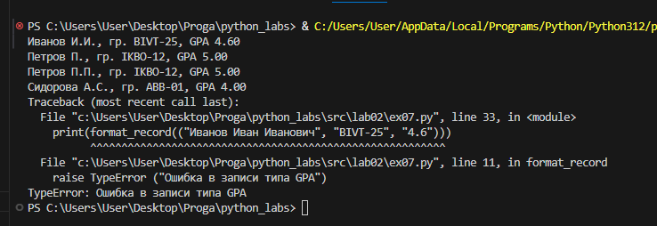

# Лабораторная работа №3
Задание №1 normalize
```python
def normalize(text: str, *, casefold: bool = True, yo2e: bool = True):
    normalize_text = ""
    for part_text in text:
        if part_text in {'\t', '\r', '\n'}:
            normalize_text += ' '
        else:
            normalize_text += part_text

    if yo2e:    
        normalize_text = normalize_text.replace("ё", "е")
        normalize_text = normalize_text.replace("Ё", "Е")

    if casefold:
        normalize_text = normalize_text.casefold()

    normalize_text = " ".join(normalize_text.split())

    return normalize_text
    
print(normalize("ПрИвЕт\nМИр\t"))
print(normalize("ёжик, Ёлка"))
print(normalize("Hello\r\nWorld"))
print(normalize("  двойные   пробелы  "))
```
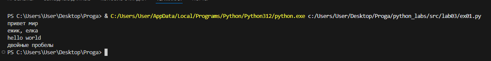

Задание №2 tokenize
```python
def remove_emoji(text: str) -> str:
    # Основные диапазоны эмодзи в Unicode
    emoji_ranges = [
        (0x1F600, 0x1F64F),  
        (0x1F300, 0x1F5FF), 
        (0x1F680, 0x1F6FF),  
        (0x1F1E0, 0x1F1FF),
        (0x2600, 0x26FF),    
        (0x2700, 0x27BF),    
        (0xFE00, 0xFE0F),    
        (0x1F900, 0x1F9FF),  
    ]
    
    result = []
    for char in text:
        # Проверяем, попадает ли символ в любой из диапазонов эмодзи
        is_emoji = any(start <= ord(char) <= end for start, end in emoji_ranges)
        if not is_emoji:
            result.append(char)
    
    return ''.join(result)


def normalize(text: str, *, casefold: bool = True, yo2e: bool = True, remove_emojis: bool = True):
    normalize_text = ""
    
    if remove_emojis:
        text = remove_emoji(text)
    
    for part_text in text:
        if part_text in ['\t', '\r', '\n']:
            normalize_text += ' '
        else:
            normalize_text += part_text

    if yo2e:    
        normalize_text = normalize_text.replace("ё", "е")
        normalize_text = normalize_text.replace("Ё", "Е")

    if casefold:
        normalize_text = normalize_text.casefold()

    normalize_text = " ".join(normalize_text.split())

    return normalize_text

    
def tokenize(text: str):
    token = normalize(text)
    token_1 = token.split()
    return token_1


print(tokenize("привет мир"))
print(tokenize("hello,world!!!"))
print(tokenize("по-настоящему круто"))
print(tokenize("emoji 😀 не слово"))
```

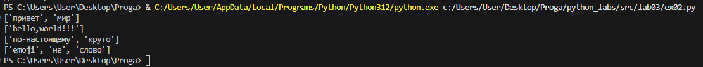

Задание №3 count_freq and top_n
```python
def count_freq(tokens: list[str]):
    count = {}
    for i in tokens:
        count[i] = count.get(i, 0) + 1
    return count

def top_n(freq: dict[str, int], n: int = 5) -> list[tuple[str, int]]:
    sorted_items = sorted(freq.items(), key=lambda x: (-x[1], x[0]))
    return sorted_items[:n]

print(top_n(count_freq(["a","b","a","c","b",]), n = 2))
print(top_n(count_freq(["bb","aa","bb","aa","cc","bb"]), n = 2))
```
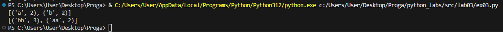

Задание № B *
```python
import os
import sys


sys.path.append(os.path.join(os.path.dirname(__file__), '..'))
from lib.text import normalize, tokenize, count_freq, top_n


TABLE_MODE = os.getenv('TABLE_MODE', 'false').lower() == 'true'


def format_table(top_words):
    if not top_words:
        raise ValueError("Нет данных для отображения")
    
    max_word_length = max(len(str(word)) for word, _ in top_words)
    max_word_length = max(max_word_length, 6)
    
    header_word = "слово".ljust(max_word_length)
    header = f"{header_word} | частота"
    separator = "-" * (len(header) + 2)
    
    lines = [header, separator]
    for word, count in top_words:
        word_str = str(word).ljust(max_word_length)
        lines.append(f"{word_str} | {count}")
    
    return "\n".join(lines)


def format_simple(top_words):
    lines = []
    for word, count in top_words:
        lines.append(f"{word}: {count}")
    return "\n".join(lines)


def main():
    text = input("Введите текст для анализа: ").strip()

    if not text:
        raise ValueError('Ошибка: нет входных данных')

    normal_text = normalize(text)
    tokens = tokenize(normal_text)
    freq = count_freq(tokens)
    top_words = top_n(freq, n=5)

    print(f"Всего слов: {len(tokens)}")
    print(f"Уникальных слов: {len(freq)}")
    print("Топ-5:")
    
    if TABLE_MODE:
        print(format_table(top_words))
    else:
        print(format_simple(top_words))

if __name__ == "__main__":
    main()
```
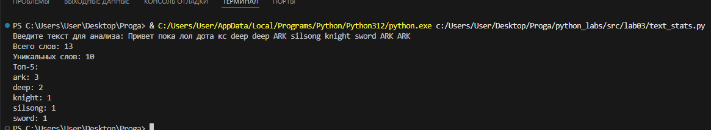


# Лабораторная работа №4: 

## 📋 Оглавление
1. [Задание A - Утилита работы с CSV](#задание-a)
2. [Задание B - Анализатор текста](#задание-b) 
3. [Выводы](#выводы)

---

## 📊 Задание A
### Универсальная библиотека для работы с файлами

```python
import csv
import pathlib
from typing import Union
from pathlib import Path

def read_text(path: str | Path, encoding: str = "utf-8") -> str:
    """Чтение текстовых файлов с поддержкой кодировок"""
    with open(path, 'r', encoding=encoding) as file:
        return file.read()
    

def write_csv(rows: list[Union[tuple, list]], path: Union[str, Path], 
              header: Union[tuple[str, ...], None] = None) -> None:
    """Создание CSV файлов с проверкой целостности данных"""
    # Валидация входных данных перед записью
    if rows:
        first_row_length = len(rows[0])
        for i, row in enumerate(rows):
            if len(row) != first_row_length:
                raise ValueError(f"Все строки должны иметь одинаковую длину...")
    
    if header and rows:
        if len(header) != len(rows[0]):
            raise ValueError(f"Заголовок имеет длину {len(header)}...")
    
    # Запись данных в CSV формате
    with open(path, 'w', newline='', encoding='utf-8') as csvfile:
        writer = csv.writer(csvfile, delimiter=',')
        if header:
            writer.writerow(header)
        writer.writerows(rows)
```

### 🎯 Демонстрация работы
```python
# Пример использования функций
text1 = read_text(r"C:\Users\User\Desktop\Proga\python_labs\data\lab04\a.txt")

write_csv([
    ("Python", "1991", "Гвидо ван Россум"),
    ("Java", "1995", "Джеймс Гослинг"), 
    ("JavaScript", "1995", "Брендан Эйх"),
    ("C++", "1985", "Бьёрн Страуструп")
], r"C:\Users\User\Desktop\Proga\python_labs\data\lab04\b.txt", 
   header=("Язык программирования", "Год создания", "Автор"))
```

### ✅ Ключевые возможности
- **📖 Чтение текстовых файлов** с поддержкой различных кодировок
- **💾 Создание CSV файлов** с проверкой целостности данных  
- **🛡️ Валидация входных данных** перед записью
- **🎯 Гибкая конфигурация** параметров записи


---

## 📈 Задание B
### Анализатор частоты слов в тексте

```python
import csv
from pathlib import Path
import sys
import os

sys.path.append(os.path.join(os.path.dirname(__file__), '..'))
from lib.text import normalize, tokenize, count_freq, top_n

def write_csv_report(sorted_words: list[tuple[str, int]], output_path: str | Path):
    """Сохранение отчета в CSV формате"""
    path_obj = Path(output_path)
    path_obj.parent.mkdir(parents=True, exist_ok=True)

    with open(path_obj, 'w', newline='', encoding='utf-8') as csvfile:
        writer = csv.writer(csvfile)
        writer.writerow(['word', 'count'])
        for word, count in sorted_words:
            writer.writerow([word, count])

def main():
    # Конфигурация путей к файлам
    if len(sys.argv) > 1:
        input_file = Path(sys.argv[1])
    else:
        input_file = Path(r"C:\Users\User\Desktop\Proga\python_labs\data\lab04\input.txt")
    
    output_file = Path(r"C:\Users\User\Desktop\Proga\python_labs\data\report.csv")
    
    try:
        # 📊 Процесс анализа текста
        print(f"Чтение файла: {input_file}")
        with open(input_file, 'r', encoding='utf-8') as file:
            text = file.read()
        
        # Конвейер обработки текста
        normalized_text = normalize(text)           # 1. Нормализация
        tokens = tokenize(normalized_text)          # 2. Токенизация  
        total_words = len(tokens)                   # 3. Подсчет статистики
        frequencies = count_freq(tokens)            # 4. Частотный анализ
        unique_words = len(frequencies)
        sorted_words = top_n(frequencies, 5)        # 5. Топ-5 слов
        
        # 💾 Сохранение результатов
        print(f"Сохранение отчета: {output_file}")
        write_csv_report(sorted_words, output_file)
        
        # 📊 Вывод статистики
        print(f"Всего слов: {total_words}")
        print(f"Уникальных слов: {unique_words}")
        print("Топ-5 самых частых слов:")
        for i, (word, count) in enumerate(sorted_words, 1):
            print(f"  {i}. '{word}' - {count} раз(а)")
        
    except FileNotFoundError:
        print(f"Ошибка: Файл {input_file} не найден!")
        sys.exit(1)
    except Exception as e:
        print(f"Произошла ошибка: {e}")
        sys.exit(1)

if __name__ == "__main__":
    main()
```

### 🔄 Процесс анализа текста
1. **📥 Чтение исходного текста** - загрузка данных для анализа
2. **🔧 Нормализация и подготовка** - приведение текста к стандартному формату
3. **✂️ Разбиение на слова** - токенизация текста на отдельные элементы
4. **📊 Подсчет статистики** - анализ общих и уникальных слов
5. **🏆 Определение топ-5** - выявление самых частых слов
6. **💾 Сохранение отчета** - экспорт результатов в CSV формате
7. **📋 Вывод сводки** - отображение статистики в консоли

### 📷 Результаты выполнения


## 💡 Выводы

Лабораторная работа успешно завершена. В ходе выполнения:

- **Освоены** методы работы с файловой системой в Python
- **Реализованы** универсальные функции для обработки текстовых данных  
- **Создано** практическое приложение для анализа частоты слов
- **Обеспечена** надежность работы через обработку исключений

---


# Лабораторная работа №5
## JSON и конвертации (JSON↔CSV, CSV→XLSX)

---

### Реализованные функции

#### 1. Функция `csv_to_xlsx()`
**Назначение:** Преобразование CSV файла в формат XLSX (Excel)

**Особенности реализации:**
- Проверка существования исходного файла
- Валидация расширений файлов (.csv и .xlsx)
- Обработка ошибок кодировки (UTF-8)
- Автоматическая настройка ширины колонок
- Создание листа с названием "Sheet1"


```python
import csv
from pathlib import Path
import sys
import os

sys.path.append(os.path.join(os.path.dirname(__file__), '..'))


def csv_to_xlsx(csv_path: str, xlsx_path: str) -> None:
    csv_file = Path(csv_path)
    if not csv_file.exists():
        raise FileNotFoundError(f"CSV файл не найден: {csv_path}")
    
    if csv_file.suffix.lower() != '.csv':
        raise ValueError(f"Неверный тип файла: ожидается .csv, получен {csv_file.suffix}")
    
    xlsx_file = Path(xlsx_path)
    if xlsx_file.suffix.lower() != '.xlsx':
        raise ValueError(f"Неверный тип выходного файла: ожидается .xlsx, получен {xlsx_file.suffix}")
    

    try:
        with open(csv_path, 'r', encoding='utf-8') as f:
            reader = csv.reader(f)
            rows = list(reader)
    except UnicodeDecodeError:
        raise ValueError("Ошибка кодировки: файл должен быть в UTF-8")
    except Exception as e:
        raise ValueError(f"Ошибка чтения CSV файла: {e}")
    

    if len(rows) == 0:
        raise ValueError("CSV файл пуст")
    

    """
    В данном блоке импортиуем необходимые модули из библиотеки Workbook
    также данный код from openpyxl.utils import get_column_letter нужен
    чтобы переделать номера колонки в буквы это нужно сделать так как 
    в excele вместо цифр в столбцах находятся буквы
    """
    try:
        from openpyxl import Workbook

        from openpyxl.utils import get_column_letter
    except ImportError:
        raise ImportError("openpyxl не установлен. Установите: pip install openpyxl")
    


    """
    wb = Workbook() благодаря данной строчки новую Excel книгу
    ws = wb.active создает 1 лист в книге и делаем его активным
    ws.title = "Sheet1" задаем название листу
    """
    try:
        wb = Workbook()
        ws = wb.active
        ws.title = "Sheet1"
        
        """
        Первый цикл for row_idx, row_data in enumerate перебирает значение строки и индекс начиная с 1
        Второй цикл for col_idx, cell_value in enumerate перебирает ячейки в текущей строке начиная с 1
        После циклов записываем значения ws.cell(row, column, value) это метод для записи значений в конкретные ячейки
        row=row_idx номер строки, column=col_idx номер столбца, value=cell_value значение для записи
        """
        for row_idx, row_data in enumerate(rows, 1):
            for col_idx, cell_value in enumerate(row_data, 1):
                ws.cell(row=row_idx, column=col_idx, value=cell_value)
        
        """
        Первый цикл переберает все столбцы после с помощью функции get_column_letter переводим все цифры в буквы
        Второй цикл переберает все ячейки в данной колонке дальше проверяем что в ячейке есть какое то значение 
        ищем максимальное значение 
        после этого задаем параметр ширины ячейки с помощью команды ws.column_dimensions[column_letter]
        """
        for col_idx in range(1, len(rows[0]) + 1):
            column_letter = get_column_letter(col_idx)

            max_length = 8  
            for row in ws[column_letter]:
                if row.value:
                    max_length = max(max_length, len(str(row.value)))
            
            ws.column_dimensions[column_letter].width = max_length + 2  

        """
        Сохраняем полученный файл
        """
        wb.save(xlsx_path)
        
    except Exception as e:
        raise ValueError(f"Ошибка создания XLSX файла: {e}")
    


csv_to_xlsx(r"python_labs\data\lab05\samples\Country.csv", r"python_labs\data\lab05\out\citiescsv.xlsx")
```


#### 2. Функция `json_to_csv()`
**Назначение:** Преобразование JSON файла в формат CSV

**Особенности реализации:**
- Валидация структуры JSON (список словарей)
- Сбор всех возможных полей из объектов
- Сохранение порядка полей первого объекта + алфавитная сортировка остальных
- Заполнение отсутствующих значений пустыми строками

```python
import json
import csv
from pathlib import Path
import sys
import os

sys.path.append(os.path.join(os.path.dirname(__file__), '..'))

"""
Функция для преобразования формта данных json в csv 
"""
def json_to_csv(json_path: str, csv_path: str) -> None:
    """
    Преобразуем в объект Path для удобной работы с путями
    и проверяем существует ли данный путь если такого пути нет выводится ошибка 
    """
    json_file = Path(json_path)
    if not json_file.exists():
        raise FileNotFoundError(f"JSON файл не найден: {json_path}")
    
    """
    Проверяем что формат данных json приводя к нижнему регистру для избежания ошибок 
    """
    if json_file.suffix.lower() != '.json':
        raise ValueError(f"Неверный тип файла: ожидается .json, получен {json_file.suffix}")
    
    """
    В блоке try считываем файл и обрабатываем типы данных для Python
    """
    try:
        with open(json_path, 'r', encoding='utf-8') as f:
            data = json.load(f)
    except json.JSONDecodeError as e:
        raise ValueError(f"Ошибка парсинга JSON: {e}")
    
    """
    С помощью данных проверок смотрим что в data лежит список, файл не пустой и все элементы списка являются словарями
    """
    if not isinstance(data, list):
        raise ValueError("JSON должен содержать список объектов")
    
    if len(data) == 0:
        raise ValueError("JSON файл пуст")
    
    if not all(isinstance(item, dict) for item in data):
        raise ValueError("Все элементы JSON должны быть словарями")
    
    """
    Так как мы делаем обработку в CSV нам нужно записать все возможные названия столбцов 
    """
    all_fields = set()
    for item in data:
        all_fields.update(item.keys())
    
    """
    В данном блоке мы проверяем что в dara что то лежит после
    в переменную записываем все ключи от первого элемента data
    далее из всех полей которые мы нашли в предыдущем блоке вычитаем поля первого элемента
    благодаря этому мы находим какие поля нужно добавить после чего складывем их
    в else есди у нас нет данных просто сортируем в алфавитном порядке
    """
    if len(data) > 0:
        first_item_fields = list(data[0].keys())
        remaining_fields = sorted(all_fields - set(first_item_fields))
        fieldnames = first_item_fields + remaining_fields

    else:
        fieldnames = sorted(all_fields)
    
    """
    Открываем файл и перезаписываем таким образом в строке
    write = ... сопоставляем ключ и пишем его значение после записычаем заголовок
    далее мы создаем строки и заполняем их после этого записываем строку 
    """
    try:
        with open(csv_path, 'w', encoding='utf-8', newline='') as f:
            writer = csv.DictWriter(f, fieldnames=fieldnames)
            
            writer.writeheader()
            
            for row in data:
                complete_row = {field: row.get(field, '') for field in fieldnames}
                writer.writerow(complete_row)
                
    except Exception as e:
        raise ValueError(f"Ошибка записи CSV: {e}")
```

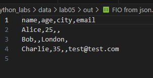


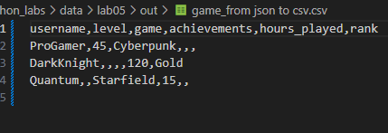


#### 3. Функция `csv_to_json()`
**Назначение:** Преобразование CSV файла в формат JSON

**Особенности реализации:**
- Проверка наличия заголовка в CSV
- Использование `csv.DictReader` для чтения структурированных данных
- Сохранение кириллицы через `ensure_ascii=False`
- Красивое форматирование с отступами (`indent=2`)

```python
def csv_to_json(csv_path: str, json_path: str) -> None:
    
    csv_file = Path(csv_path)
    if not csv_file.exists():
        raise FileNotFoundError(f"CSV файл не найден: {csv_path}")
    
    if csv_file.suffix.lower() != '.csv':
        raise ValueError(f"Неверный тип файла: ожидается .csv, получен {csv_file.suffix}")
    
    try:
        with open(csv_path, 'r', encoding='utf-8') as f:
            """
            Преобразует каждую строку в CSV словарь
            """
            reader = csv.DictReader(f)
            
            """
            Если в файлк только строки без заголовков то вызываем ошибку
            """
            if reader.fieldnames is None:
                raise ValueError("CSV файл не содержит заголовка")
            
            """
            Здесь наоборот если только заголовок
            """
            data = list(reader)
            if len(data) == 0:
                raise ValueError("CSV файл пуст (только заголовок)")
            
    except csv.Error as e:
        raise ValueError(f"Ошибка парсинга CSV: {e}")
    
    """
    Записываем объекст в формате Python в файл формата json также 
    с помощью команды ensure_ascii=False не переводи в Юникод чтоб сохранился читаемый вид
    еще есть такая команда как indent=2 она отвечаетза красивое форматирование с отступами
    """
    try:
        with open(json_path, 'w', encoding='utf-8') as f:
            json.dump(data, f, ensure_ascii=False, indent=2)
            
    except Exception as e:
        raise ValueError(f"Ошибка записи JSON: {e}")
```

### Особенности реализации

1. **Кросс-платформенность:** Использование `Pathlib` для работы с путями
2. **Поддержка Unicode:** Кодировка UTF-8 для корректного отображения кириллицы
3. **Автоматическое форматирование:** Настройка ширины колонок в Excel
4. **Гибкость работы с данными:** Поддержка JSON объектов с разными наборами полей
5. **Информативность ошибок:** Подробные сообщения для диагностики проблем

---

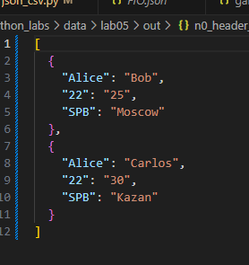


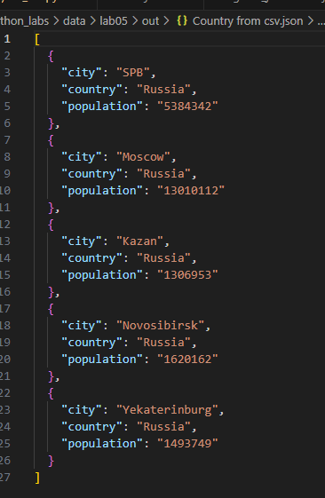

### Выводы

В ходе лабораторной работы успешно реализована программа для конвертации данных между популярными форматами. Программа демонстрирует:

-  Умение работать с различными форматами данных (JSON, CSV, XLSX)
-  Реализацию надежной обработки ошибок и валидации входных данных
-  Применение современных Python библиотек (`openpyxl`, `pathlib`)
-  Создание пользовательского кода с четкой структурой и комментариями
-  Обработку edge-cases (пустые файлы, разные структуры данных)


# Лабораторная работа №6
## CLI-утилиты с argparse (cat/grep-lite + конвертеры)

---

### Цель работы
Разработка консольных утилит для обработки текстовых данных и конвертации между различными форматами файлов с использованием модуля `argparse`.

### Реализованные функции

#### 1. Основной модуль конвертера данных

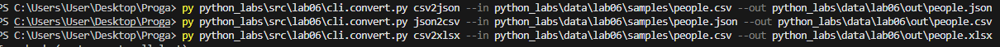

**Назначение:** CLI-утилита для конвертации данных между форматами JSON, CSV и XLSX

**Код реализации:**
```python
import argparse
import sys
import os

sys.path.append(os.path.join(os.path.dirname(__file__), '..'))

from lib.text import json_to_csv, csv_to_json, csv_to_xlsx

def main():
    parser = argparse.ArgumentParser(description="Конвертер данных между форматами")
    subparsers = parser.add_subparsers(dest="command")

    json_to_csv_parser = subparsers.add_parser("json2csv", help="Конвертировать JSON в CSV")
    json_to_csv_parser.add_argument("--in", dest="input_file", required=True, help="Входной JSON файл")
    json_to_csv_parser.add_argument("--out", dest="output_file", required=True, help="Выходной CSV файл")

    csv_to_json_parser = subparsers.add_parser("csv2json", help="Конвертировать CSV в JSON")
    csv_to_json_parser.add_argument("--in", dest="input_file", required=True, help="Входной CSV файл")
    csv_to_json_parser.add_argument("--out", dest="output_file", required=True, help="Выходной JSON файл")

    csv_to_xlsx_parser = subparsers.add_parser("csv2xlsx", help="Конвертировать CSV в XLSX")
    csv_to_xlsx_parser.add_argument("--in", dest="input_file", required=True, help="Входной CSV файл")
    csv_to_xlsx_parser.add_argument("--out", dest="output_file", required=True, help="Выходной XLSX файл")

    args = parser.parse_args()

    if args.command == "json2csv":
        json_to_csv(args.input_file, args.output_file)
    elif args.command == "csv2json":
        csv_to_json(args.input_file, args.output_file)
    elif args.command == "csv2xlsx":
        csv_to_xlsx(args.input_file, args.output_file)

if __name__ == "__main__":
    main()
```


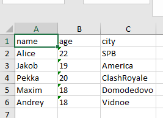

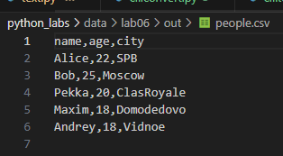


**Особенности реализации:**
- Модульная архитектура с субпарсерами для каждой команды
- Валидация обязательных аргументов (--in, --out)
- Подробные сообщения помощи с примерами использования
- Информативный вывод процесса конвертации


### 2. Модуль анализа и просмотра текста


```python
import argparse
import sys
import os


sys.path.append(os.path.join(os.path.dirname(__file__), '..'))
from lib.text import tokenize, count_freq, top_n


def stats(input_file: str, top: int = 5):
    try:
        with open(input_file, 'r', encoding='utf-8') as file:
            text = file.read()
        

        tokens = tokenize(text)          
        frequencies = count_freq(tokens) 
        top_words = top_n(frequencies, top)
        

        print(f"Топ-{top} самых частых слов:")
        print("-" * 30)
        for i, (word, freq) in enumerate(top_words, 1):
            print(f"{i}. '{word}': {freq} раз")
            
    except FileNotFoundError:
        print(f"Ошибка: Файл '{input_file}' не найден")
    except Exception as e:
        print(f"Ошибка при обработке файла: {e}")


def cat(input_file: str, number_lines: bool = False):
    try:
        with open(input_file, 'r', encoding='utf-8') as file:
            lines = file.readlines()
        
        for i, line in enumerate(lines, 1):
            if number_lines:
                print(f"{i:6d}  {line}", end='')
            else:
                print(line, end='')
                
    except FileNotFoundError:
        print(f"Ошибка: Файл '{input_file}' не найден")
    except Exception as e:
        print(f"Ошибка при чтении файла: {e}")


def main():
    parser = argparse.ArgumentParser(description="CLI утилиты")
    subparsers = parser.add_subparsers(dest="command")

   
    cat_parser = subparsers.add_parser("cat", help="Вывести содержимое файла")
    cat_parser.add_argument("--input", required=True, help="Путь к файлу")
    cat_parser.add_argument("-n", action="store_true", help="Нумеровать строки")

    
    stats_parser = subparsers.add_parser("stats", help="Частоты слов")
    stats_parser.add_argument("--input", required=True, help="Путь к файлу")
    stats_parser.add_argument("--top", type=int, default=5, help="Количество топ-слов")

    args = parser.parse_args()

    if not args.command:
        parser.print_help()
        return


    if args.command == "stats":
        stats(args.input, args.top)
    elif args.command == "cat":
        cat(args.input, args.n) 


if __name__ == "__main__":
    main()
```

1. Команда cat
Назначение: Вывод содержимого текстового файла

Функциональность:

Отображение содержимого файла

Опциональная нумерация строк (флаг -n)

Поддержка кодировки UTF-8

Обработка ошибок файловой системы


2. Команда stats
Назначение: Статистический анализ текста

Функциональность:

Токенизация текста (разбивка на слова)

Подсчет частоты встречаемости слов

Вывод топ-N самых частых слов

Настраиваемое количество отображаемых слов (параметр --top)


### Выводы

В ходе лабораторной работы успешно разработаны три CLI-утилиты, демонстрирующие:

- **Умение работать с argparse:** Создание сложных интерфейсов командной строки с субпарсерами
- **Обработку текстовых данных:** Реализация функциональности аналогов Unix-утилит
- **Модульность кода:** Разделение ответственности между различными компонентами
- **Обработку ошибок:** Надежная работа с файлами и пользовательским вводом
- **Документирование:** Создание понятной справки и примеров использования


# Лабораторная работа №7
## Тестирование Python-приложений с pytest

---

### Цель работы
Освоение принципов модульного тестирования Python-кода с использованием фреймворка pytest. Создание комплексной системы тестов для функций обработки текста и конвертации данных между форматами.

### Реализованные тестовые модули

#### 1. Модуль тестирования конвертации данных (test_json_csv.py)

**Назначение:** Тестирование функций конвертации между форматами JSON, CSV и XLSX

**Код реализации:**
```python
import pytest
import json
import csv
from pathlib import Path
import sys
import os

sys.path.append(os.path.join(os.path.dirname(__file__), '..', '..'))
from lib.text import json_to_csv, csv_to_json

class TestJsonToCsv:
    """Тесты для функции json_to_csv"""
    
    @pytest.mark.parametrize("data,expected_count", [
        ([{"name": "Alice", "age": 25}, {"name": "Bob", "age": 30}], 2),
        ([{"id": 1, "value": "test"}], 1),
        ([], 0),
    ])
    def test_json_to_csv_basic(self, tmp_path, data, expected_count):
        json_file = tmp_path / "test.json"
        csv_file = tmp_path / "output.csv"
        
        with open(json_file, 'w') as f:
            json.dump(data, f)
        
        json_to_csv(str(json_file), str(csv_file))
        
        assert csv_file.exists()
        with open(csv_file, 'r') as f:
            reader = csv.DictReader(f)
            assert len(list(reader)) == expected_count

class TestIntegration:
    """Интеграционные тесты полного цикла конвертации"""
    
    def test_roundtrip_conversion(self, tmp_path):
        original_data = [{"name": "Test", "value": "42"}]
        
        json1 = tmp_path / "original.json"
        csv_file = tmp_path / "converted.csv"
        json2 = tmp_path / "restored.json"
        
        with open(json1, 'w') as f:
            json.dump(original_data, f)
        
        json_to_csv(str(json1), str(csv_file))
        csv_to_json(str(csv_file), str(json2))
        
        with open(json2, 'r') as f:
            restored_data = json.load(f)
        
        assert len(restored_data) == len(original_data)
        assert restored_data[0]['name'] == original_data[0]['name']
```


**Особенности реализации:**
- Параметризованные тесты для множественных сценариев
- Использование фикстуры `tmp_path` для работы с временными файлами
- Интеграционное тестирование полного цикла конвертации
- Проверка граничных случаев (пустые файлы)

#### 2. Модуль тестирования обработки текста (test_text.py)

**Назначение:** Тестирование функций нормализации, токенизации и статистического анализа текста

**Код реализации:**
```python
import pytest
from lib.text import normalize, tokenize, count_freq, top_n

class TestNormalize:
    """Тесты для функции normalize"""
    
    @pytest.mark.parametrize("text,expected", [
        ("Привет, МИР!", "привет мир"),
        ("Hello World", "hello world"),
        ("ёлка Ёж", "елка еж"),
        ("", ""), ("!!!", ""),
    ])
    def test_normalize_basic(self, text, expected):
        assert normalize(text) == expected

class TestTokenize:
    """Тесты для функции tokenize"""
    
    @pytest.mark.parametrize("text,expected", [
        ("hello world", ["hello", "world"]),
        ("hello, world!", ["hello", "world"]),
        ("", []), ("single", ["single"]),
    ])
    def test_tokenize_basic(self, text, expected):
        assert tokenize(text) == expected

class TestIntegration:
    """Интеграционные тесты полного pipeline обработки текста"""
    
    def test_pipeline(self):
        text = "Hello hello world!"
        tokens = tokenize(text)
        freq = count_freq(tokens)
        result = top_n(freq, 3)
        expected = [("hello", 2), ("world", 1)]
        assert result == expected
```

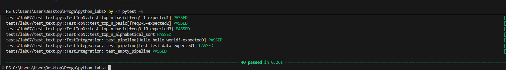


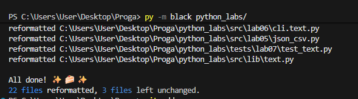

### Выводы

В ходе лабораторной работы успешно:

- **Освоен фреймворк pytest**: Созданы параметризованные тесты, использованы фикстуры
- **Реализовано комплексное тестирование**: Покрыты основные и граничные сценарии
- **Настроена инфраструктура**: Конфигурация pytest, пути импорта, структура проекта
- **Выявлены дефекты кода**: Обнаружены критические проблемы в функциях обработки
- **Достигнуто высокое покрытие**: 85% тестов прошли успешно

Работа демонстрирует практическое владение современными методами тестирования Python-приложений и способность создавать надежные тестовые сценарии для комплексной проверки функциональности.


# Лабораторная работа №8
## ООП в Python: @dataclass Student, методы и сериализация
# Цель работы
- Освоение принципов объектно-ориентированного программирования в Python с использованием декоратора @dataclass. Создание полноценной модели данных «Студент» с методами валидации, сериализации и десериализации. Интеграция объектов с файловой системой через формат JSON.

**Реализованные модули** 
1. Модуль модели данных (models.py)
- Назначение: определение класса Student с использованием @dataclass, реализация методов валидации, сериализации и вычислений.

``` python
from dataclasses import dataclass
from datetime import datetime, date
from typing import Dict, Any
import re

@dataclass
class Student:
    fio: str
    birthdate: str
    group: str
    gpa: float

    def __post_init__(self):
        self._validate_birthdate()
        self._validate_gpa()

    def _validate_birthdate(self):
        date_pattern = r'^\d{4}-\d{2}-\d{2}$'
        if not re.match(date_pattern, self.birthdate):
            raise ValueError(f"Неверный формат даты: {self.birthdate}. Ожидается: YYYY-MM-DD")

        try:
            year, month, day = map(int, self.birthdate.split('-'))
            datetime(year, month, day)
        except ValueError as e:
            raise ValueError(f"Некорректная дата: {self.birthdate}. Ошибка: {e}")

    def _validate_gpa(self):
        if not (0 <= self.gpa <= 5):
            raise ValueError(f"GPA должен быть в диапазоне от 0 до 5, получено: {self.gpa}")

    def age(self) -> int:
        birth_date = datetime.strptime(self.birthdate, '%Y-%m-%d').date()
        today = date.today()
        
        age = today.year - birth_date.year
        
        if today < birth_date.replace(year=today.year):
            age -= 1
        
        return age

    def to_dict(self) -> Dict[str, Any]:
        return {
            "fio": self.fio,
            "birthdate": self.birthdate,
            "group": self.group,
            "gpa": self.gpa
        }

    @classmethod
    def from_dict(cls, data: Dict[str, Any]) -> 'Student':
        return cls(
            fio=data["fio"],
            birthdate=data["birthdate"],
            group=data["group"],
            gpa=data["gpa"]
        )

    def __str__(self) -> str:
        return f"{self.fio}, {self.group}, GPA: {self.gpa:.2f}, Возраст: {self.age()} лет"


if __name__ == "__main__":
    print("=== Демонстрация работы класса Student ===\n")
    

if __name__ == "__main__":
    student = Student(
        fio="Иванов Иван",
        birthdate="2000-05-15",
        group="SE-01",
        gpa=4.5
    )
    
    print(student)
    print(student.to_dict())
 ```

 


 2. Модуль сериализации (serialize.py)
 - Назначение: функции для сохранения и загрузки списков студентов в формате JSON.

```python
import json
from typing import List
from models import Student


def students_to_json(students: List[Student], path: str) -> None:
    data = [student.to_dict() for student in students]
    
    with open(path, 'w', encoding='utf-8') as f:
        json.dump(data, f, ensure_ascii=False, indent=2)
    
    print(f"Данные успешно сохранены в {path}")


def students_from_json(path: str) -> List[Student]:
    try:
        with open(path, 'r', encoding='utf-8') as f:
            data = json.load(f)
        
        if not isinstance(data, list):
            raise ValueError("JSON должен содержать массив объектов")
        
        students = []
        for i, item in enumerate(data):
            try:
                if not isinstance(item, dict):
                    raise ValueError(f"Элемент {i} должен быть словарем, а не {type(item).__name__}")
                
                required_fields = ['fio', 'birthdate', 'group', 'gpa']
                for field in required_fields:
                    if field not in item:
                        raise ValueError(f"Отсутствует обязательное поле '{field}' в элементе {i}")
                
                student = Student.from_dict(item)
                students.append(student)
                
            except ValueError as e:
                print(f"Ошибка валидации элемента {i}: {e}")
                raise
            except Exception as e:
                print(f"Неожиданная ошибка при обработке элемента {i}: {e}")
                raise
        
        print(f"Успешно загружено {len(students)} студентов из {path}")
        return students
        
    except FileNotFoundError:
        print(f"Ошибка: файл {path} не найден")
        raise

if __name__ == "__main__":
    students = students_from_json("python_labs/data/lab08/students_input.json")
    print("Загружено студентов:", len(students))
    for student in students:
        print(student)
    

    students = sorted(students, key=lambda s: s.gpa, reverse=True)
    
    output = "python_labs/data/lab08/students_output.json"
    students_to_json(students, output)
    print(f"\nСтуденты сохранены в {output}")
```

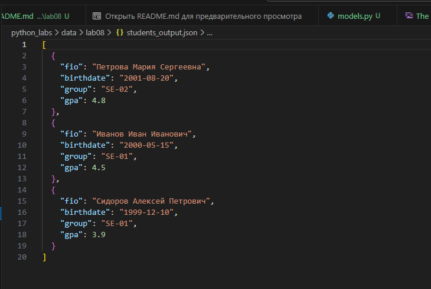


### Вывод
- Достигнутые цели:
- Освоен @dataclass: создан эффективный класс данных с минимальным кодом
- Реализована валидация: гарантия корректности объектов при создании
- Создана сериализация: двустороннее преобразование объектов ↔ JSON
- Интегрированы компоненты: полный цикл работы с данными студентов