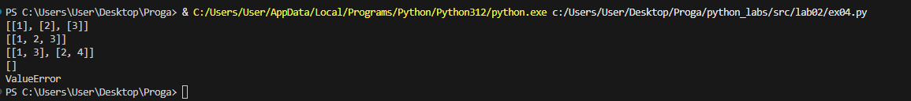

<<<<<<< HEAD
# python_labs
# Лабораторная работа №1 
 Задание №1
```python
Name = input()
Age = int(input())
print("Привет,", Name + "!" ,"Через год тебе будет", Age + 1, end = ".")
```


 Задание №2
```python
a = float(input())
b = float(input())
sum = a + b
avg = (a + b) / 2
print(sum)
print(avg)
```

 Задание №3
```python
price = int(input())
discount = int(input())
vat = int(input())
base = price * (1 - discount / 100)
vat_amount = base * (vat/100)
total = base + vat_amount
print("База после скидки:", f"{base:.2f}")
print("НДС:", f"{vat_amount:.2f}")
print("Итого к оплате:", f"{total:.2f}")
```

 Задание №4
```python
minutes = int(input())
print(minutes // 60, ":",minutes % 60, sep = "")
```

 Задание №5
```python
a, b, c = input(), input(), input()
print("Инициалы:", a[0], b[0],c[0],sep = "")
print("Длина:", len(a + b + c), sep = "")
```


 Задание №7 
```python
a = "thisisabracadabraHt1eadljjl12ojh."
index1 = 0
for j in range(0, len(a)):
    for i in "QWERTYUIOPASDFGHJKLZXCVBNM":
        if a[j] == i:
            index1 = j
            break

index2 = 0
for c in range(0, len(a) - 1):
    if (a[c] in "0123456789") and ((a[c + 1] in "qwertyuiopasdfghjklzxcvbnm") or (a[c + 1] in "QWERTYUIOPASDFGHJKLZXCVBNM")):
        index2 = c
        break

razn = abs(index1 - index2) + 1
g = a[index1::]
m= ""
for k in range(0, len(g), razn):
    m += g[k]
print(m)
```


# Лабораторная работа №2
 Задание №1
```python
def min_max(nums: list[float | int]) -> tuple[float | int, float | int]:
    if len(nums) == 0:
        return ("ValueError")
    else:
        return min(nums), max(nums)

print(min_max([3, -1, 5, 5, 0]))
print(min_max([]))
print(min_max([-5, -2, -9]))
```


 Задание №2
``` python
def unique_sorted(nums: list[float | int]) -> list[float | int]:
    if len(nums) == 0:
        return nums
    else:
        mnojestvo = set(nums)
        mnojestvo = sorted(mnojestvo)
        return mnojestvo
    
print(unique_sorted([3, 1, 2, 1, 3]))
print(unique_sorted([]))
print(unique_sorted([-1, -1, 0, 2, 2]))
```


Задание №3
```python
def flatten(mat: list[list | tuple]) -> list:
    sp = []
    for i in mat:
        if not isinstance(i, (list, tuple)):
            return "TypeError"
        else:
            sp.extend(i)    
    return sp

print(flatten([[1, 2], [3, 4]]))
print(flatten([[1, 2], (3, 4, 5)]))
print(flatten([[1], [], [2, 3]]))
print(flatten([[1, 2], "ab"]))
```


Задание №4
```python
def transpose(mat: list[list[float | int]]):
    if len(mat) == 0:
        return []
    
    dlina = len(mat[0])
    for i in range(0, len(mat)):
        if dlina != len(mat[i]):
            return "ValueError"
        
    col_strok = len(mat)
    col_stolb = len(mat[0])

    novaimatr = []

    for index_stolb in range(col_stolb):
        nov_strok = []
        for index_strok in range(col_strok):
            nov_strok.append(mat[index_strok][index_stolb])
        novaimatr.append(nov_strok)

    return novaimatr

print(transpose([[1, 2, 3]]))
print(transpose([[1], [2], [3]]))
print(transpose([[1, 2], [3, 4]]))
print(transpose([]))
print(transpose([[1, 2], [3]]))
```


Задание №5
```python
def row_sums(mat: list[list[float | int]]) -> list[float]:
    dlina = len(mat[0])
    for i in range(0, len(mat)):
        if dlina != len(mat[i]):
            return "ValueError"
        
    summi = []
    for j in range(0, len(mat)):
        summi.append(sum(mat[j]))

    return summi

print(row_sums([[1, 2, 3], [4, 5, 6]]))
print(row_sums([[-1, 1], [10, -10]]))
print(row_sums([[0, 0], [0, 0]]))
print(row_sums([[1, 2], [3]]))
```


Задание №6
```python
def col_sums(mat: list[list[float | int]]) -> list[float]:
    dlina = len(mat[0])
    for i in range(0, len(mat)):
        if dlina != len(mat[i]):
            return "ValueError"
    
    sp = []
    for index_stolb in range(len(mat[0])):
        summa = 0
        for riad in mat:
            summa += riad[index_stolb]
        
        sp.append(summa)

    return sp


print(col_sums([[1, 2, 3], [4, 5, 6]]))
print(col_sums([[-1, 1], [10, -10]]))
print(col_sums([[0, 0], [0, 0]]))
print(col_sums([[1, 2], [3]]))

```


Задание №7
```python
def format_record(rec: tuple[str, str, float]):
    if len(rec) == 3 and isinstance(rec, tuple):

        name, group, eval = rec

        if not isinstance(name, str):
            raise TypeError ("Ошибка в записи ФИО")
        if not isinstance(group, str):
            raise TypeError ("Ошибка в записи группы")
        if not isinstance(eval, float):
            raise TypeError ("Ошибка в записи типа GPA")
        
        clean_name = " ".join(name.strip().split())
        parts_initialos = clean_name.split()
        familia = parts_initialos[0].title()
        initiale = ".".join(first[0].upper() for first in parts_initialos[1:]) + '.'

        new_group = group.strip()

        new_eval = f"{eval:.2f}"

        itog = f"{familia} {initiale}, гр. {new_group}, GPA {new_eval}" 

        return itog
    
    else:
        raise TypeError ("Некорректные записи (пустое ФИО, пустая группа, неверный тип GPA")

print(format_record(("Иванов Иван Иванович", "BIVT-25", 4.6)))
print(format_record(("Петров Пётр", "IKBO-12", 5.0)))
print(format_record(("Петров Пётр Петрович", "IKBO-12", 5.0)))
print(format_record(("  сидорова  анна   сергеевна ", "ABB-01", 3.999)))
print(format_record(("Иванов Иван Иванович", "BIVT-25", "4.6")))
print(format_record(( "BIVT-25", 4.6)))


```


